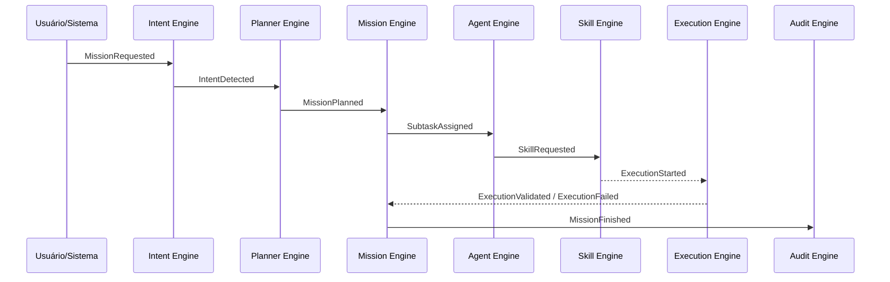

# Event Model — Tudo é Evento

## A filosofia

Quando alguém diz "Sigma, participe da reunião do cliente Brenno", nenhuma função é chamada diretamente. Um evento é gerado. Esse evento é observado por quem precisa reagir a ele, que por sua vez gera o próximo evento. O SIGMA não é uma cadeia de chamadas — é uma sequência de eventos publicados e consumidos. Isso é o que torna o sistema uma plataforma, não um script: qualquer Engine novo pode passar a reagir a um evento existente sem que quem o publica precise saber que esse novo consumidor existe. Ver [ADR-0008](docs/adr/0008-arquitetura-orientada-a-eventos.md) e [ADR-0018](docs/adr/0018-tudo-e-evento.md).

## A sequência canônica de uma Mission

Cada seta é um evento publicado no Event Bus (ver [services/event-bus](services/event-bus/)), nunca uma chamada síncrona direta entre Engines — mesmo quando, na prática, a latência entre publicar e reagir for próxima de zero.

## Catálogo de eventos (canônico)

Nome de classe (PHP, PascalCase) e nome publicado no Event Bus (dot.case — ver [docs/conventions/naming-conventions.md](docs/conventions/naming-conventions.md)):

| Evento | Publicado por | Nome no Event Bus |
|---|---|---|
| `MissionRequested` | Kernel (porta de entrada) | `mission.requested` |
| `IntentDetected` | Intent Engine | `intent.detected` |
| `IntentRejected` | Intent Engine | `intent.rejected` |
| `MissionPlanned` | Planner Engine | `mission.planned` |
| `SubtasksCreated` | Mission Engine | `subtasks.created` |
| `SubtaskAssigned` | Agent Engine | `subtask.assigned` |
| `SkillRequested` | Skill Engine | `skill.requested` |
| `ExecutionStarted` | Execution Engine | `execution.started` |
| `ExecutionValidated` | Execution Engine | `execution.validated` |
| `ExecutionFailed` | Execution Engine | `execution.failed` |
| `MissionFinished` | Mission Engine | `mission.finished` |
| `MissionCancelled` | Mission Engine | `mission.cancelled` |

Este catálogo é a fonte única da verdade para nomes de evento do fluxo de Mission — [ARCHITECTURE.md §6](docs/architecture/ARCHITECTURE.md) referencia este documento em vez de duplicar a lista, para não divergir com o tempo.

## Regras

1. Todo evento carrega, no mínimo: identificador da Mission de origem, timestamp, e o Engine publicador — sem isso, o Audit Engine não consegue correlacionar.
2. Um evento é um fato consumado, não uma instrução — `SkillRequested` não é uma ordem "execute isso agora", é o registro de que o Agent Engine decidiu que uma Skill precisa ser invocada; quem reage decide como e quando.
3. Eventos não são removidos ou reescritos — mudança incompatível de payload gera um novo evento versionado (`mission.finished.v2`), nunca uma alteração silenciosa do que já existe. Ver [ADR-0008](docs/adr/0008-arquitetura-orientada-a-eventos.md).
4. Novos Engines/consumidores assinam eventos existentes sem exigir mudança em quem publica — esse é o teste de que a arquitetura orientada a eventos está sendo respeitada.
