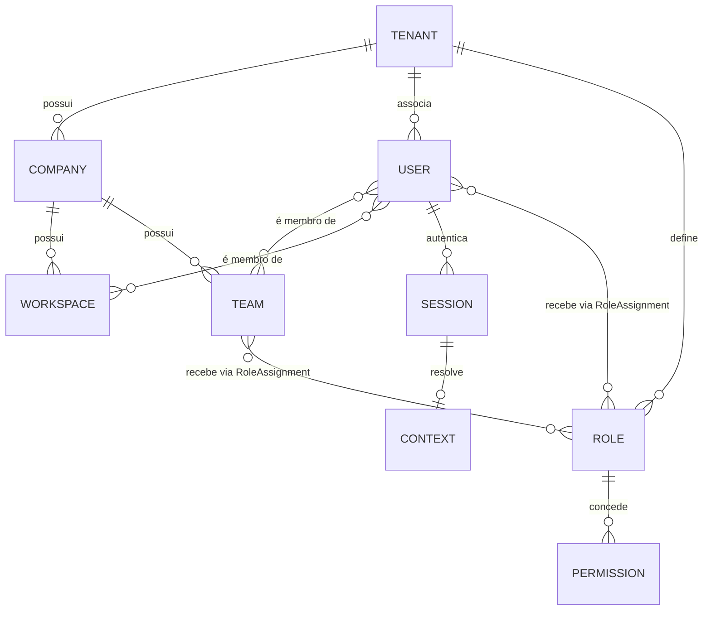

# Identity Model

Modelo de identidade do SIGMA — as entidades que respondem "quem" (distinto do Memory Engine, que responde "o que sei/aprendi") e como elas se relacionam. Escrito antes de qualquer código do Identity Engine (Release 3), por decisão explícita do Product Owner: nenhuma linha de código do Identity é escrita antes deste modelo estar aprovado.

Algumas destas entidades já foram mencionadas, de forma dispersa, em [DOMAIN.md](DOMAIN.md), [MULTITENANCY.md](MULTITENANCY.md), [WORKSPACES.md](WORKSPACES.md) e [SIGMA_PROTOCOL.md §5](SIGMA_PROTOCOL.md#5-autonomia-progressiva). Este documento não os substitui — é onde a modelagem completa e as **relações** entre eles ficam consolidadas em um único lugar, para que o schema do Identity Engine nasça coerente em vez de crescer entidade por entidade, cada uma reinventando um pedaço do que já existe. Duas entidades aqui são novas e não existiam antes em lugar nenhum: **Permission** e **Session**. As demais ganham aqui sua definição completa; onde algo já estava dito, este documento referencia em vez de duplicar.

## As dez entidades

### Tenant

Fronteira de isolamento total de dados — o nível mais alto da hierarquia. Toda tabela de domínio carrega `tenant_id` obrigatório desde o primeiro schema (ver [MULTITENANCY.md](MULTITENANCY.md), [ADR-0021](docs/adr/0021-multitenancy-desde-o-schema.md)). Hoje existe um único Tenant real ("Alfa Soluções").

### Company

Uma empresa dentro de um Tenant (GW, Delta, Invest). Em nome de quem o SIGMA opera; não confundir com `Client`, que é uma entidade de negócio orquestrada, não gerida, pelo SIGMA (ver [DOMAIN.md](DOMAIN.md)).

### Workspace

A unidade de contexto operacional dentro de uma Company — agrupa Client/Project/Budget/Meeting/Document relacionados (ver [WORKSPACES.md](WORKSPACES.md), [ADR-0020](docs/adr/0020-workspace-como-unidade-de-contexto.md)). Não é persistido como dado próprio duplicado — agrega, via Skill, o que já existe nos sistemas de origem.

### User

Uma pessoa com acesso ao SIGMA, associada a exatamente um Tenant. Autor de Missions, membro de um ou mais Teams e de um ou mais Workspaces.

### Team

Um agrupamento de Users, escopado a uma Company. Existe por dois motivos: (1) visão agregada sobre Missions de seus membros; (2) atribuir um Role a um Team em vez de repetir a atribuição User a User — todo membro do Team herda os Roles atribuídos a ele. Um Team em si não é sujeito de autenticação; não tem Session própria.

### Role

Um conjunto nomeado de Permissions, aplicável a um User ou a um Team, sempre em um escopo específico (Tenant, Company ou Workspace — ver "RoleAssignment" abaixo). Carrega um **nível de Autonomia Progressiva** (0–3) — ver [SIGMA_PROTOCOL.md §5](SIGMA_PROTOCOL.md#5-autonomia-progressiva) e [ADR-0029](docs/adr/0029-autonomia-progressiva.md). Exemplos: "Comercial", "Técnico", "Administrativo". Um Role pertence a um Tenant — cada Tenant pode ter seus próprios Roles customizados, além de um conjunto de Roles padrão fornecido pelo próprio SIGMA.

### Permission

**Nova nesta modelagem.** Uma ação discreta e concedível, identificada por uma chave string no formato `<recurso>.<ação>` — ex: `mission.create`, `budget.approve`, `workspace.manage`. Uma Permission nunca é atribuída diretamente a um User ou Team — sempre através de um Role. Isso é deliberado: é a decisão central deste modelo para evitar que a modelagem de identidade cresça de forma inconsistente (ver "Por que Permission nunca é direta" abaixo). O campo `permissions` já existe nos [Sigma Contracts](contracts/README.md) (ver `contracts/Module.contract.yaml`) como lista de chaves exigidas — este documento formaliza a entidade que concede essas chaves, do lado do Identity.

### Autonomy Level

Um inteiro de 0 a 3 (ver [SIGMA_PROTOCOL.md §5](SIGMA_PROTOCOL.md#5-autonomia-progressiva)). Não é uma entidade própria — é um atributo de Role. Como um RoleAssignment é sempre escopado (Tenant, Company ou Workspace), o Autonomy Level efetivo de um User já varia naturalmente por escopo, sem precisar de um mecanismo à parte: o mesmo User pode ser Operacional (3) no Workspace de um cliente e Consultivo (1) em outro, através de Roles diferentes atribuídos em cada escopo.

### Context

**Não é uma entidade persistida** — é um objeto de valor, resolvido em runtime pelo Kernel a partir de uma Session ativa, e disponibilizado a todo Engine como o "contexto de execução" já mencionado em [WORKSPACES.md](WORKSPACES.md) e [MULTITENANCY.md](MULTITENANCY.md). Combina: a Session vigente, o User autenticado, o Workspace ativo selecionado (se houver), a Company e o Tenant daí derivados, e o conjunto de Permissions e o Autonomy Level efetivos para aquele escopo (resolvidos a partir dos RoleAssignments do User, e dos Teams de que participa, válidos naquele escopo). Todo Engine recebe Context, nenhum monta sua própria versão dele.

### Session

**Nova nesta modelagem.** O registro durável de que um User está autenticado — token/credencial, momento de emissão, momento de expiração, e o Workspace ativo selecionado nessa sessão (se houver um selecionado). Um User pode ter múltiplas Sessions simultâneas (web, mobile, integração). Session é o dado persistido de onde um Context é resolvido a cada requisição — Session é estado; Context é a projeção momentânea desse estado mais o que foi resolvido de Role/Permission/Autonomy para aquela chamada.

## Relações

| Relação | Cardinalidade | Observação |
|---|---|---|
| Tenant → Company | 1 para N | Toda Company pertence a exatamente um Tenant |
| Company → Workspace | 1 para N | Todo Workspace pertence a exatamente uma Company |
| Tenant → User | 1 para N | Todo User pertence a exatamente um Tenant — nunca compartilhado entre Tenants |
| User ↔ Workspace | N para N | Via `WorkspaceMembership` — um User acessa múltiplos Workspaces conforme seu escopo |
| Company → Team | 1 para N | Todo Team pertence a exatamente uma Company |
| User ↔ Team | N para N | Via `TeamMembership` |
| Tenant → Role | 1 para N | Todo Role pertence a exatamente um Tenant (customizado por Tenant, com padrões fornecidos pelo SIGMA) |
| Role → Permission | N para N | Via `RolePermission` — um Role concede várias Permissions; uma Permission pode ser concedida por vários Roles |
| (User \| Team) → Role | N para N, escopado | Via `RoleAssignment { subjectType: User\|Team, subjectId, roleId, scopeType: Tenant\|Company\|Workspace, scopeId }` — a mesma atribuição carrega o escopo em que vale |
| User → Session | 1 para N | Um User pode ter múltiplas Sessions simultâneas |
| Session → Context | 1 para 1, por requisição | Context nunca é persistido; é derivado a cada chamada a partir da Session vigente |

## Por que Permission nunca é direta

Se uma Permission pudesse ser concedida diretamente a um User, além de através de um Role, o modelo teria dois caminhos concorrentes para a mesma pergunta ("este User pode fazer X?") — um auditável por Role (legível, nomeado, com Autonomy Level junto) e outro disperso em exceções individuais, sem nome, sem nível de autonomia associado. É exatamente esse crescimento inconsistente que motivou este documento existir antes do código. A única unidade de concessão de Permission é o Role; a única forma de dar a um User (ou Team) mais acesso é atribuir um Role a mais, nunca uma Permission solta.

## Como isso se conecta ao resto do SIGMA

- **Autorização de Capability**: uma chamada de Capability declara `permissions` (chaves exigidas) e `autonomy_level_required` no seu Contract (ver `contracts/Module.contract.yaml`). O Kernel resolve o Context da Session vigente e verifica: (1) todas as `permissions` exigidas estão no conjunto efetivo de Permissions do Context; (2) `autonomy_level_required` ≤ `autonomyLevelEffective` do Context (ver [SIGMA_PROTOCOL.md §5](SIGMA_PROTOCOL.md#5-autonomia-progressiva) — regra do **menor valor** entre User/Role e Capability). Falha em qualquer um dos dois é rejeição explícita, nunca silenciosa.
- **Envelope**: `audit.autonomyLevelEffective` no [Envelope](SIGMA_PROTOCOL.md#1-o-envelope) é resolvido diretamente do Context daquela chamada.
- **Digital Twin de User**: existe (ver [DOMAIN.md](DOMAIN.md)), mas é sobre dados de negócio agregados de um User (ex: histórico), não sobre Role/Permission — autorização nunca passa pelo Twin, sempre pelo Identity Engine em tempo real.

## O que este modelo não decide

- Schema físico de tabelas (nomes de coluna, índices, migrations) — isso é Implementation da Release 3, não deste modelo.
- Se existirão Roles/Permissions "de sistema" pré-semeados vs. só custom por Tenant — decisão de Escopo da Proposal da Release 3, não deste documento.
- Fluxo de autenticação (login, OAuth, 2FA) — Session, aqui, é definida em termos do que ela *é* e como se relaciona com Context; o mecanismo de emissão de Session é escopo de implementação da Release 3.

## Onde vive

Fundação em `packages/identity-engine`/`services/auth` — Release 3 — Identity Engine (ver [ADR-0039](docs/adr/0039-identity-engine.md)). Consumido por todo Engine seguinte através do Context disponibilizado pelo [Kernel](KERNEL.md).
