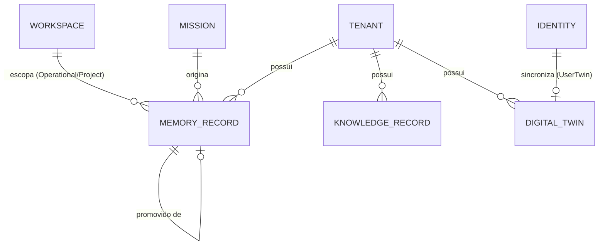

# Memory Model

Modelo de domínio do Memory Engine — as entidades que respondem "o que o SIGMA sabe e o que ele aprendeu" (distinto do Identity Engine, que responde "quem" — ver [ADR-0039](docs/adr/0039-identity-engine.md)) e como elas se relacionam. Escrito antes de qualquer código da Release 4, mesmo princípio já seguido por [IDENTITY_MODEL.md](IDENTITY_MODEL.md) na Release 3: nenhuma linha de código do Memory Engine é escrita antes deste modelo estar aprovado.

[MEMORY_ARCHITECTURE.md](MEMORY_ARCHITECTURE.md), [DIGITAL_TWIN.md](DIGITAL_TWIN.md) e [DOMAIN.md](DOMAIN.md) já definem os conceitos de Memory (três níveis), Knowledge e Digital Twin em prosa — este documento é onde eles ganham modelagem completa: entidades, identificadores, relações, e as duas mecânicas que os três documentos anteriores deixaram deliberadamente em aberto ("a mecânica exata de promoção é definida no épico do Memory Engine", "frequência e escopo de refresh do Twin definidos no épico de implementação"). Resolver essas duas mecânicas é o objetivo central deste documento.

## Três conceitos, um custodiante, três naturezas distintas

[DIGITAL_TWIN.md](DIGITAL_TWIN.md) já afirma isso, vale repetir porque é a decisão mais importante deste modelo: **Knowledge, Memory e Digital Twin não são a mesma coisa** — cada um tem uma pergunta e uma natureza diferente, e só compartilham custodiante (o Memory Engine) por afinidade operacional, não por serem o mesmo conceito.

| Conceito | Pergunta que responde | Natureza | Curadoria |
|---|---|---|---|
| **Knowledge** | O que a Alfa sabe sobre seu próprio negócio | Factual, curado | Humana, deliberada (`/knowledge`) |
| **Memory** | O que o SIGMA aprendeu observando Missions | Experiencial, inferido | Automática, via repetição/generalização |
| **Digital Twin** | Qual é o estado atual de uma entidade externa agora | Factual, volátil | Automática, via Semantic Event |

## As entidades

### MemoryRecord

Um fato experiencial observado pelo SIGMA — a unidade dos três níveis de Memory ([ADR-0022](docs/adr/0022-memory-em-tres-niveis.md)). Carrega:

- `level`: `Operational` \| `Project` \| `LongTerm` — ver [MEMORY_ARCHITECTURE.md](MEMORY_ARCHITECTURE.md) para a definição de cada nível.
- `subjectKey`: uma chave estável identificando **do que** o registro trata (ex: `client.brenno.discount-behavior`) — é essa chave que a promoção usa para detectar repetição/generalização (ver "Como a promoção funciona" abaixo).
- `content`: o fato em si, em texto ou estrutura simples — o que foi observado.
- `tenantId`: sempre presente ([ADR-0021](docs/adr/0021-multitenancy-desde-o-schema.md)).
- `workspaceId`: presente em `Operational` e `Project`; ausente em `LongTerm` (que é cross-Workspace, por definição).
- `missionId`: presente só em `Operational` — a Mission que originou a observação.
- `sourceMissionIds`: lista de Missions que já reforçaram este `subjectKey` dentro do mesmo Workspace — cresce a cada repetição observada, é o que a regra de promoção consulta.
- `promotedFrom`: referência opcional a outro `MemoryRecord` — a proveniência de um registro promovido, nunca perdida.

### KnowledgeRecord

Um fato curado sobre o negócio da Alfa, alimentado por `/knowledge` (ver [DOMAIN.md](DOMAIN.md#knowledge)). Carrega:

- `area`: uma das sete pastas já existentes em [/knowledge](knowledge/) — `clientes`, `produtos`, `empresa`, `processos`, `comercial`, `marketing`, `engenharia`.
- `sourcePath`: o arquivo de origem dentro de `/knowledge`.
- `title`/`content`: extraídos do Markdown de origem.
- `tenantId`: sempre presente.

Diferente de `MemoryRecord`: nunca tem `level` (Knowledge não atravessa níveis, é sempre a mesma natureza — curada), nunca tem `missionId`/`workspaceId` obrigatórios (conhecimento institucional tipicamente não é escopado a um Workspace, ainda que uma entrada de `clientes/` na prática fale de um cliente específico).

### DigitalTwin

A representação viva de uma entidade externa — [DIGITAL_TWIN.md](DIGITAL_TWIN.md). Carrega:

- `subjectType`: `Client` \| `Project` \| `Company` \| `User`.
- `externalRef`: o identificador no sistema de origem (ex: id do cliente no Gestor.Alfa) — para `subjectType: User`, é o `UserId` do Identity Engine (interno ao SIGMA, não externo — ver "Fronteira com o Identity Engine" abaixo).
- `state`: a representação estruturada atual — o "retrato" da entidade.
- `lastSyncedAt`: quando `state` foi atualizado pela última vez.
- `tenantId`: sempre presente.

Nunca é a fonte da verdade — toda escrita de negócio continua indo direto ao sistema externo via Capability ([ADR-0007](docs/adr/0007-comunicacao-somente-via-api.md)); `DigitalTwin` só reflete o que já aconteceu, via Semantic Event.

## Como a promoção funciona

A pergunta que [MEMORY_ARCHITECTURE.md](MEMORY_ARCHITECTURE.md) e [ADR-0022](docs/adr/0022-memory-em-tres-niveis.md) deixaram em aberto — resolvida aqui:

1. **Operational → Project**: um `MemoryRecord` `Operational` é promovido a `Project` quando o mesmo `subjectKey`, dentro do mesmo `workspaceId`, aparece em **mais de uma Mission** — ou seja, `sourceMissionIds` do `subjectKey` acumula 2+ entradas dentro do mesmo Workspace. É **repetição**: o mesmo padrão, no mesmo contexto, mais de uma vez.
2. **Project → LongTerm**: um `MemoryRecord` `Project` é promovido a `LongTerm` quando o mesmo `subjectKey` (ou uma forma generalizada dele — ex: `client.*.discount-behavior` em vez de `client.brenno.discount-behavior`) aparece como `Project` Memory em **mais de um Workspace**. É **generalização**: o padrão deixa de ser sobre um cliente específico e passa a ser sobre um comportamento de negócio.
3. Uma promoção nunca apaga o registro de origem — ela cria um novo `MemoryRecord` no nível de destino com `promotedFrom` apontando para o original. O registro original permanece, intacto, como evidência.
4. A avaliação de promoção é uma operação explícita (`EvaluatePromotion`, ver Release 4A) — chamável sob demanda nesta Release. Automação por agendamento (rodando periodicamente) depende do componente estrutural **Scheduler**, ainda sem Release própria ([ROADMAP.md](ROADMAP.md)) — não antecipado aqui.

Nenhuma promoção é automática de `Operational` direto para `LongTerm` — precisa passar por `Project`, sempre (regra já fixada em [ADR-0022](docs/adr/0022-memory-em-tres-niveis.md), preservada aqui).

## Como o Digital Twin é sincronizado

1. Primeira leitura via uma Capability de leitura (ex: `GestorSkill.FindClient`, Release 8) cria o `DigitalTwin`.
2. Toda vez que um Semantic Event chega (ex: `budget.created_via_gestor`, ou `identity.created`/`workspace.selected` do Identity Engine hoje), o Memory Engine atualiza `state` e `lastSyncedAt` do Twin correspondente.
3. Refresh periódico (para mudanças externas que o SIGMA não causou) depende do componente estrutural **Scheduler** — mesma dependência da promoção de Memory, não antecipado com mais detalhe aqui.
4. Um Twin fora da janela de refresh esperada produz um `warning` no Envelope de qualquer resposta que o utilize — nunca falha silenciosamente (regra já fixada em [DIGITAL_TWIN.md](DIGITAL_TWIN.md), preservada aqui).

## Fronteira com o Identity Engine — decisão sobre o UserTwin

[DIGITAL_TWIN.md](DIGITAL_TWIN.md) previa o primeiro Twin real (`ClientTwin`) só a partir da Release 8 (quando `GestorSkill` existir). Mas o Identity Engine (Release 3) **já publica eventos reais hoje** (`identity.created`, `workspace.selected` — ver [EVENT_CATALOG.md](EVENT_CATALOG.md)), com "Memory Engine" já documentado como consumidor esperado desde a Release 3.5. Decisão deste modelo: a Release 4 **entrega o mecanismo genérico de `DigitalTwin` para os quatro `subjectType`, e popula de fato o `UserTwin`** a partir dos eventos que o Identity Engine já publica — não precisa esperar por `GestorSkill`. `ClientTwin`/`ProjectTwin`/`CompanyTwin` ficam com o schema pronto, mas vazios, até a Release 8.

`UserTwin` nunca carrega Role/Permission/Autonomy — isso é autorização, resolvida sempre em tempo real pelo Identity Engine, nunca pelo Twin (regra já fixada em [IDENTITY_MODEL.md](IDENTITY_MODEL.md#como-isso-se-conecta-ao-resto-do-sigma), preservada aqui).

## Fronteira com a Release 16 — Knowledge Engine

A Release 4 entrega **persistência e consulta estruturada simples** do que já existe em `/knowledge` — indexar por `area`/`title`/`sourcePath`, busca textual direta (`LIKE`/full-text do MariaDB). A Release 16 — Knowledge Engine ([ROADMAP.md](ROADMAP.md)) matura isso em busca semântica de verdade, sobre uma base muito maior (Clientes, Produtos, Playbooks, ADRs, Decisions — não só `/knowledge`). A Release 4 não antecipa embeddings, ranking semântico ou fontes além de `/knowledge` — isso é explicitamente escopo da Release 16.

## Relações

| Relação | Cardinalidade | Observação |
|---|---|---|
| Tenant → MemoryRecord/KnowledgeRecord/DigitalTwin | 1 para N | Toda entidade deste modelo carrega `tenant_id`, sem exceção (ADR-0021) |
| Workspace → MemoryRecord | 1 para N, condicional | Obrigatório em `Operational`/`Project`; ausente em `LongTerm` |
| Mission → MemoryRecord | 1 para N, condicional | Só em `Operational` |
| MemoryRecord → MemoryRecord | 0 ou 1 (`promotedFrom`) | Auto-referência, rastreia proveniência de uma promoção |
| Identity (evento) → DigitalTwin (`subjectType: User`) | 1 para 1 | `UserTwin` sincronizado a partir dos eventos do Identity Engine, sem esperar por Release 8 |

## O que este modelo não decide

- Schema físico de tabelas — Implementation da Release 4A/4B, não deste modelo.
- Agendamento automático de promoção/refresh — depende do componente estrutural Scheduler, sem Release própria ainda.
- Busca semântica/embeddings sobre Knowledge — escopo da Release 16.
- A primeira Capability de leitura real (`GestorSkill.FindClient`) e a população de `ClientTwin`/`ProjectTwin`/`CompanyTwin` — escopo da Release 8.
- Formato exato de serialização de `content`/`state` (JSON Schema por tipo) — Implementation.

## Onde vive

Fundação em `packages/memory-engine` — Release 4 ([ROADMAP.md](ROADMAP.md)). Consome identidade/contexto já resolvido pelo Identity Engine através do Kernel — nunca resolve Tenant/Company/Workspace por conta própria (regra já fixada em [ADR-0039](docs/adr/0039-identity-engine.md), preservada aqui).
