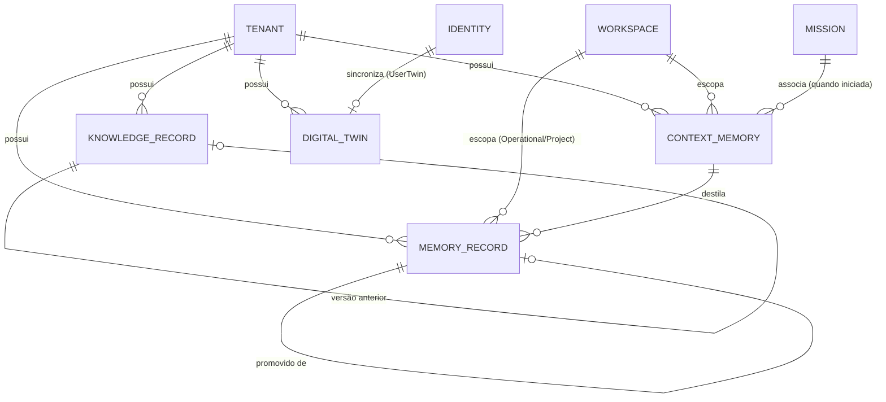

# Memory Model

Modelo de domínio do Memory Engine — as entidades que respondem "o que o SIGMA sabe e o que ele aprendeu" (distinto do Identity Engine, que responde "quem" — ver [ADR-0039](docs/adr/0039-identity-engine.md)) e como elas se relacionam. Escrito antes de qualquer código da Release 4, mesmo princípio já seguido por [IDENTITY_MODEL.md](IDENTITY_MODEL.md) na Release 3: nenhuma linha de código do Memory Engine é escrita antes deste modelo estar aprovado.

**Revisão 2.** A revisão 1 definia três entidades (`MemoryRecord`/`KnowledgeRecord`/`DigitalTwin`) e foi aprovada com nota 10/10, com uma evolução pedida explicitamente pelo Product Owner antes do código: uma quarta entidade (`ContextMemory`), quatro atributos/invariantes novos, e uma exigência separada ([MEMORY_PROMOTION_RULES.md](MEMORY_PROMOTION_RULES.md)). Este documento incorpora essa evolução — nenhuma decisão da revisão 1 foi revertida, só estendida. Mudanças desta revisão seguem o [Processo Oficial de Desenvolvimento de Engines do SIGMA](docs/adr/0082-processo-oficial-de-desenvolvimento-de-engines.md) ([ADR-0082](docs/adr/0082-processo-oficial-de-desenvolvimento-de-engines.md)), formalizado nesta mesma rodada.

[MEMORY_ARCHITECTURE.md](MEMORY_ARCHITECTURE.md), [DIGITAL_TWIN.md](DIGITAL_TWIN.md) e [DOMAIN.md](DOMAIN.md) já definem os conceitos de Memory (três níveis), Knowledge e Digital Twin em prosa — este documento é onde eles ganham modelagem completa: entidades, identificadores, relações, e as mecânicas que os documentos anteriores deixaram deliberadamente em aberto.

## Quatro conceitos, um custodiante, quatro naturezas distintas

[DIGITAL_TWIN.md](DIGITAL_TWIN.md) já afirma isso para três dos quatro, vale repetir e estender — é a decisão mais importante deste modelo: **ContextMemory, Memory, Knowledge e Digital Twin não são a mesma coisa** — cada um tem uma pergunta e uma natureza diferente, e só compartilham custodiante (o Memory Engine) por afinidade operacional, não por serem o mesmo conceito.

| Conceito | Pergunta que responde | Natureza | Curadoria |
|---|---|---|---|
| **ContextMemory** | O que está sendo dito/observado agora, neste engajamento | Bruta, efêmera | Automática, descartável |
| **Memory** | O que o SIGMA aprendeu observando Missions | Experiencial, inferido | Automática, via repetição/generalização |
| **Knowledge** | O que a Alfa sabe sobre seu próprio negócio | Factual, curado | Humana, deliberada (`/knowledge`) |
| **Digital Twin** | Qual é o estado atual de uma entidade externa agora | Factual, volátil | Automática, via Semantic Event |

## O pipeline completo

Decisão do Product Owner, incorporada nesta revisão: as quatro entidades formam um pipeline de destilação progressiva — cada estágio reduz volume e aumenta durabilidade.

```
Conversation (Mission, não modelada aqui)
      ↓
ContextMemory   — bruto, efêmero, vive só durante o engajamento
      ↓ (destilação, no fechamento do engajamento)
MemoryRecord    — fato experiencial, com confidence, três níveis
      ↓ (candidatura — nunca automática, ver "Fronteira com Knowledge" abaixo)
KnowledgeRecord — fato curado, imutável, versionado
      ↓ (fora deste pipeline — Digital Twin nasce de Semantic Event, não de Knowledge)
DigitalTwin     — estado atual de uma entidade externa
```

`DigitalTwin` **não** é o último elo de uma cadeia que começa em `Conversation` — é alimentado por um pipeline paralelo e independente (Semantic Event → Projection → Twin, ver "Como o Digital Twin é sincronizado"). O diagrama acima descreve proximidade conceitual de destilação (bruto → curado), não uma dependência de dados entre `KnowledgeRecord` e `DigitalTwin` — os dois nunca se referenciam.

## As entidades

### ContextMemory

Entidade nova desta revisão. O estágio bruto e efêmero de um engajamento em andamento — o que está sendo dito/observado *agora*, antes de qualquer julgamento sobre o que vale a pena reter. Carrega:

- `id` (`ContextMemoryId`).
- `tenantId`: sempre presente.
- `workspaceId`: sempre presente — um engajamento sempre acontece dentro de um Workspace.
- `missionId`: presente quando o engajamento está associado a uma Mission já iniciada; ausente para conversas pré-Mission (ex: uma troca inicial que ainda está sendo triada pelo Intent Engine).
- `origin`: de onde o engajamento chega — mesmo atributo aberto de `MemoryRecord.origin` (ver abaixo), copiado para o `MemoryRecord` resultante na destilação.
- `rawContent`: o conteúdo bruto do engajamento — texto corrido, sem estrutura imposta. Este documento não define um limite de tamanho nem um formato interno; é decisão de Implementation.
- `startedAt` / `endedAt` (nullable): janela de vida do engajamento.
- `status`: `Active` \| `Closed`.

`ContextMemory` **não participa da escada Operational/Project/LongTerm** — não é um nível de Memory, é o que existe *antes* de qualquer `MemoryRecord` existir. Não é promovido; é **destilado**: quando o engajamento fecha (`status: Closed`), o Memory Engine avalia `rawContent` e produz zero ou mais `MemoryRecord` `Operational` — zero quando nada no engajamento atinge o piso de `confidence` definido em [MEMORY_PROMOTION_RULES.md](MEMORY_PROMOTION_RULES.md#quando-uma-memory-nasce), não necessariamente um-para-um.

Um `ContextMemory` fechado e já destilado **não é apagado imediatamente** — sua retenção bruta (para auditoria/depuração de por que uma destilação aconteceu de um jeito) segue uma política de expiração própria, mais curta que a de `MemoryRecord`, definida em [MEMORY_PROMOTION_RULES.md](MEMORY_PROMOTION_RULES.md#quando-uma-memory-expira). `ContextMemory` nunca é consultado por outro Engine como fonte de fato — só `MemoryRecord`/`KnowledgeRecord`/`DigitalTwin` são.

### MemoryRecord

Um fato experiencial observado pelo SIGMA — a unidade dos três níveis de Memory ([ADR-0022](docs/adr/0022-memory-em-tres-niveis.md)). Carrega:

- `level`: `Operational` \| `Project` \| `LongTerm` — ver [MEMORY_ARCHITECTURE.md](MEMORY_ARCHITECTURE.md) para a definição de cada nível.
- `subjectKey`: uma chave estável identificando **do que** o registro trata (ex: `client.brenno.discount-behavior`) — é essa chave que a promoção usa para detectar repetição/generalização (ver "Como a promoção funciona" abaixo).
- `content`: o fato em si, em texto ou estrutura simples — o que foi observado, já destilado de um `ContextMemory` (nunca o texto bruto integral).
- `confidence`: **atributo novo desta revisão.** Um `float` entre `0.0` e `1.0` — quão confiável o Memory Engine considera este fato no momento em que foi registrado ou reavaliado. Gate explícito de promoção: um `MemoryRecord` com `confidence` abaixo do piso definido em [MEMORY_PROMOTION_RULES.md](MEMORY_PROMOTION_RULES.md#quando-uma-memory-sobe) nunca é promovido, mesmo que a repetição/generalização de `subjectKey` já seria suficiente — o exemplo do Product Owner: `0.35` não promove, `0.97` promove. `confidence` não decai automaticamente com o tempo nesta Release (isso dependeria do Scheduler); é recalculado só quando `EvaluatePromotion` roda de novo sobre o mesmo `subjectKey`.
- `origin`: **atributo novo desta revisão.** De onde o fato chegou — `Telegram` \| `GitHub` \| `Meeting` \| `Email` \| `WhatsApp` \| `Claude` \| `ChatGPT` \| `Gemini` \| `Manual`, entre outros. Modelado como **string aberta**, não como enum fechado em código: uma nova origem de integração (ex: um novo canal no futuro) não deve exigir alteração de código no `Domain/` do Memory Engine para ser aceita — só um valor novo de string. A lista acima é a lista de valores *conhecidos hoje*, documentada, não um conjunto fechado.
- `tenantId`: sempre presente ([ADR-0021](docs/adr/0021-multitenancy-desde-o-schema.md)).
- `workspaceId`: presente em `Operational` e `Project`; ausente em `LongTerm` (que é cross-Workspace, por definição).
- `missionId`: presente só em `Operational` — a Mission que originou a observação.
- `sourceMissionIds`: lista de Missions que já reforçaram este `subjectKey` dentro do mesmo Workspace — cresce a cada repetição observada, é o que a regra de promoção consulta.
- `promotedFrom`: referência opcional a outro `MemoryRecord` — a proveniência de um registro promovido, nunca perdida.
- `status`: **atributo novo desta revisão.** `Active` \| `Deprecated` \| `Retracted` — responde "quando uma Memory desce", pergunta que [MEMORY_PROMOTION_RULES.md](MEMORY_PROMOTION_RULES.md#quando-uma-memory-desce) exigia. Um `MemoryRecord` nunca é rebaixado de nível em lugar (a escada Operational/Project/LongTerm é sempre construída para cima, criando registros novos — ver "Como a promoção funciona"); "descer" significa este registro deixar de ser confiável, não perder nível. Mecânica completa em [MEMORY_PROMOTION_RULES.md](MEMORY_PROMOTION_RULES.md).

### KnowledgeRecord

Um fato curado sobre o negócio da Alfa, alimentado por `/knowledge` (ver [DOMAIN.md](DOMAIN.md#knowledge)). Carrega:

- `area`: uma das sete pastas já existentes em [/knowledge](knowledge/) — `clientes`, `produtos`, `empresa`, `processos`, `comercial`, `marketing`, `engenharia`.
- `sourcePath`: o arquivo de origem dentro de `/knowledge` — também a chave de lineage entre versões (ver abaixo).
- `title`/`content`: extraídos do Markdown de origem.
- `version`: **atributo novo desta revisão.** Inteiro, começa em `1`. `KnowledgeRecord` é **imutável — nunca editado em lugar**: uma atualização do arquivo de origem em `/knowledge` cria um novo `KnowledgeRecord` com `version` incrementado, o registro anterior permanece intacto e consultável (mesmo espírito de versionamento de Git, citado explicitamente pelo Product Owner).
- `previousVersionId`: referência opcional ao `KnowledgeRecord` da versão anterior — junto de `sourcePath` (que agrupa todas as versões da mesma linhagem), permite tanto navegar a cadeia (`previousVersionId`) quanto encontrar a versão corrente sem percorrê-la (maior `version` para o mesmo `sourcePath`+`tenantId`).
- `tenantId`: sempre presente.

Diferente de `MemoryRecord`: nunca tem `level` (Knowledge não atravessa níveis, é sempre a mesma natureza — curada), nunca tem `missionId`/`workspaceId` obrigatórios (conhecimento institucional tipicamente não é escopado a um Workspace, ainda que uma entrada de `clientes/` na prática fale de um cliente específico), e agora nunca é sobrescrito — só versionado.

### DigitalTwin

A representação viva de uma entidade externa — [DIGITAL_TWIN.md](DIGITAL_TWIN.md). Carrega:

- `subjectType`: `Client` \| `Project` \| `Company` \| `User`.
- `externalRef`: o identificador no sistema de origem (ex: id do cliente no Gestor.Alfa) — para `subjectType: User`, é o `UserId` do Identity Engine (interno ao SIGMA, não externo — ver "Fronteira com o Identity Engine" abaixo).
- `state`: a representação estruturada atual — o "retrato" da entidade.
- `lastSyncedAt`: quando `state` foi atualizado pela última vez.
- `tenantId`: sempre presente.

Nunca é a fonte da verdade — toda escrita de negócio continua indo direto ao sistema externo via Capability ([ADR-0007](docs/adr/0007-comunicacao-somente-via-api.md)); `DigitalTwin` só reflete o que já aconteceu, via Semantic Event.

## Como a promoção funciona

A pergunta que [MEMORY_ARCHITECTURE.md](MEMORY_ARCHITECTURE.md) e [ADR-0022](docs/adr/0022-memory-em-tres-niveis.md) deixaram em aberto — resolvida em [ADR-0081](docs/adr/0081-mecanica-de-promocao-de-memory.md), agora combinada com o gate de `confidence` desta revisão ([ADR-0084](docs/adr/0084-confidence-como-gate-de-promocao.md)):

1. **Operational → Project**: um `MemoryRecord` `Operational` é promovido a `Project` quando (a) o mesmo `subjectKey`, dentro do mesmo `workspaceId`, aparece em **mais de uma Mission** — `sourceMissionIds` acumula 2+ entradas dentro do mesmo Workspace — **e** (b) `confidence` está no piso ou acima dele. É **repetição**: o mesmo padrão, no mesmo contexto, mais de uma vez, com confiança suficiente.
2. **Project → LongTerm**: um `MemoryRecord` `Project` é promovido a `LongTerm` quando (a) o mesmo `subjectKey` (ou uma forma generalizada dele — ex: `client.*.discount-behavior` em vez de `client.brenno.discount-behavior`) aparece como `Project` Memory em **mais de um Workspace** **e** (b) `confidence` está no piso mais alto exigido para este salto (ver [MEMORY_PROMOTION_RULES.md](MEMORY_PROMOTION_RULES.md)). É **generalização**: o padrão deixa de ser sobre um cliente específico e passa a ser sobre um comportamento de negócio.
3. Uma promoção nunca apaga o registro de origem — ela cria um novo `MemoryRecord` no nível de destino com `promotedFrom` apontando para o original. O registro original permanece, intacto, como evidência.
4. A avaliação de promoção é uma operação explícita (`EvaluatePromotion`, ver Release 4A) — chamável sob demanda nesta Release. Automação por agendamento (rodando periodicamente) depende do componente estrutural **Scheduler**, ainda sem Release própria ([ROADMAP.md](ROADMAP.md)) — não antecipado aqui.

Nenhuma promoção é automática de `Operational` direto para `LongTerm` — precisa passar por `Project`, sempre (regra já fixada em [ADR-0022](docs/adr/0022-memory-em-tres-niveis.md), preservada aqui). Os pisos exatos de `confidence` para cada salto, quem pode ajustá-los, e o que acontece com um `MemoryRecord` que nunca atinge o piso, são respondidos em [MEMORY_PROMOTION_RULES.md](MEMORY_PROMOTION_RULES.md) — este documento só fixa que o gate existe e onde ele entra no fluxo.

Um `MemoryRecord` já promovido pode ser contradito por uma observação posterior — isso nunca apaga nem reverte o registro (`status` muda para `Deprecated`/`Retracted`, o registro permanece como histórico). A mecânica completa de contradição/retração/expiração é [ADR-0088](docs/adr/0088-retracao-expiracao-e-governanca-de-promocao.md), detalhada em [MEMORY_PROMOTION_RULES.md](MEMORY_PROMOTION_RULES.md).

## Fronteira com Knowledge — candidatura, nunca promoção automática

**Tensão real identificada nesta revisão, resolvida explicitamente, não decidida em silêncio.** O pipeline pedido pelo Product Owner (`ContextMemory → MemoryRecord → KnowledgeRecord`) lido literalmente sugeriria que um `MemoryRecord` `LongTerm` vira `KnowledgeRecord` automaticamente. Isso conflita com uma decisão já estabelecida antes desta Release e reafirmada na tabela acima: Knowledge é **sempre** curadoria humana, deliberada, via `/knowledge` ([DOMAIN.md](DOMAIN.md#knowledge), [MEMORY_ARCHITECTURE.md](MEMORY_ARCHITECTURE.md)) — nunca uma escrita automática de um Engine.

Resolução ([ADR-0087](docs/adr/0087-memoryrecord-origin-e-candidatura-a-knowledge.md)): quando um `MemoryRecord` atinge `LongTerm`, o Memory Engine publica um evento (`MemoryPromoted` com `toLevel: LongTerm`, já catalogado) que sinaliza o fato como **candidato** a virar Knowledge — nunca cria nem edita um `KnowledgeRecord` diretamente. A transformação de candidato em `KnowledgeRecord` real (`version: 1`, ou nova versão de um `sourcePath` já existente) continua exigindo uma ação humana explícita via `/knowledge`, mesmo fluxo de sempre. Isso preserva a curadoria humana da tabela "Quatro conceitos" acima e ainda honra o espírito do pipeline do Product Owner: o SIGMA aponta o que aprendeu e que parece durável, mas nunca decide sozinho o que a Alfa "sabe" institucionalmente. O mecanismo de apresentar esse candidato a um humano (uma fila, uma notificação, uma tela) é decisão de Implementation/Interfaces — fora do escopo deste modelo.

## Como o Digital Twin é sincronizado

**Invariante reforçado nesta revisão** ([ADR-0085](docs/adr/0085-digital-twin-estritamente-event-driven.md)): **todo Digital Twin — sem exceção, incluindo a primeira população — nasce e muda de estado exclusivamente através de `Evento → Projection → Twin`.** Nunca existe um caminho de leitura direta (Memory Engine chamando uma Capability por conta própria e escrevendo o resultado no Twin) — mesmo a primeira leitura é modelada como evento.

1. **Primeira população**: para `subjectType: User`, o evento `identity.created` do Identity Engine já cumpre esse papel — nenhuma Capability de leitura é necessária. Para `Client`/`Project`/`Company` (Release 8 em diante), a primeira leitura via Capability (ex: `GestorSkill.FindClient`) **publica um evento próprio** (ex: `client.fetched_via_gestor`) antes de qualquer Twin ser criado — a Capability nunca escreve no Twin diretamente, ela só causa um evento, e é esse evento que o Memory Engine projeta. O desenho exato desse evento de "leitura" é decisão da Release 8 (quando `GestorSkill` for modelada), não deste documento — a exigência fixada aqui é só a de que ele precisa existir, para que a regra "sempre via evento" não tenha exceção.
2. **Atualizações seguintes**: toda vez que um Semantic Event chega (ex: `budget.created_via_gestor`, `identity.created`/`workspace.selected` do Identity Engine hoje), o Memory Engine projeta a mudança e atualiza `state`/`lastSyncedAt` do Twin correspondente.
3. Refresh periódico (para mudanças externas que o SIGMA não causou) depende do componente estrutural **Scheduler** — quando existir, também dispara via evento (um evento técnico de "refresh solicitado"), não via leitura direta — mesma disciplina, sem exceção nova.
4. Um Twin fora da janela de refresh esperada produz um `warning` no Envelope de qualquer resposta que o utilize — nunca falha silenciosamente (regra já fixada em [DIGITAL_TWIN.md](DIGITAL_TWIN.md), preservada aqui).

## Fronteira com o Identity Engine — decisão sobre o UserTwin

[DIGITAL_TWIN.md](DIGITAL_TWIN.md) previa o primeiro Twin real (`ClientTwin`) só a partir da Release 8 (quando `GestorSkill` existir). Mas o Identity Engine (Release 3) **já publica eventos reais hoje** (`identity.created`, `workspace.selected` — ver [EVENT_CATALOG.md](EVENT_CATALOG.md)), com "Memory Engine" já documentado como consumidor esperado desde a Release 3.5. Decisão deste modelo: a Release 4 **entrega o mecanismo genérico de `DigitalTwin` para os quatro `subjectType`, e popula de fato o `UserTwin`** a partir dos eventos que o Identity Engine já publica — não precisa esperar por `GestorSkill`. `ClientTwin`/`ProjectTwin`/`CompanyTwin` ficam com o schema pronto, mas vazios, até a Release 8.

`UserTwin` nunca carrega Role/Permission/Autonomy — isso é autorização, resolvida sempre em tempo real pelo Identity Engine, nunca pelo Twin (regra já fixada em [IDENTITY_MODEL.md](IDENTITY_MODEL.md#como-isso-se-conecta-ao-resto-do-sigma), preservada aqui).

## Fronteira com a Release 16 — Knowledge Engine

A Release 4 entrega **persistência e consulta estruturada simples** do que já existe em `/knowledge`, agora com versionamento imutável. A Release 16 — Knowledge Engine ([ROADMAP.md](ROADMAP.md)) matura isso em busca semântica de verdade, sobre uma base muito maior (Clientes, Produtos, Playbooks, ADRs, Decisions — não só `/knowledge`). A Release 4 não antecipa embeddings, ranking semântico ou fontes além de `/knowledge` — isso é explicitamente escopo da Release 16.

## Relações



| Relação | Cardinalidade | Observação |
|---|---|---|
| Tenant → ContextMemory/MemoryRecord/KnowledgeRecord/DigitalTwin | 1 para N | Toda entidade deste modelo carrega `tenant_id`, sem exceção (ADR-0021) |
| Workspace → ContextMemory | 1 para N | Todo engajamento acontece dentro de um Workspace |
| Workspace → MemoryRecord | 1 para N, condicional | Obrigatório em `Operational`/`Project`; ausente em `LongTerm` |
| Mission → ContextMemory | 1 para N, condicional | Ausente para engajamentos pré-Mission |
| ContextMemory → MemoryRecord | 1 para N, condicional | Destilação no fechamento; pode gerar zero registros |
| MemoryRecord → MemoryRecord | 0 ou 1 (`promotedFrom`) | Auto-referência, rastreia proveniência de uma promoção |
| KnowledgeRecord → KnowledgeRecord | 0 ou 1 (`previousVersionId`) | Auto-referência, rastreia a versão anterior da mesma linhagem (`sourcePath`) |
| Identity (evento) → DigitalTwin (`subjectType: User`) | 1 para 1 | `UserTwin` sincronizado a partir dos eventos do Identity Engine, sem esperar por Release 8 |

## O que este modelo não decide

- Schema físico de tabelas — Implementation da Release 4A/4B, não deste modelo.
- Pisos exatos de `confidence` por salto de promoção, política de expiração de `ContextMemory`/`MemoryRecord` e quem pode intervir na promoção — respondido em [MEMORY_PROMOTION_RULES.md](MEMORY_PROMOTION_RULES.md), não aqui.
- Agendamento automático de promoção/refresh — depende do componente estrutural Scheduler, sem Release própria ainda.
- Busca semântica/embeddings sobre Knowledge — escopo da Release 16.
- A primeira Capability de leitura real (`GestorSkill.FindClient`), o evento técnico de "leitura" que ela publica, e a população de `ClientTwin`/`ProjectTwin`/`CompanyTwin` — escopo da Release 8.
- O mecanismo de apresentação de um candidato a Knowledge a um humano (fila, notificação, tela) — Implementation/Interfaces.
- Formato exato de serialização de `content`/`rawContent`/`state` (JSON Schema por tipo) — Implementation.

## Onde vive

Fundação em `packages/memory-engine` — Release 4 ([ROADMAP.md](ROADMAP.md)). Consome identidade/contexto já resolvido pelo Identity Engine através do Kernel — nunca resolve Tenant/Company/Workspace por conta própria (regra já fixada em [ADR-0039](docs/adr/0039-identity-engine.md), preservada aqui).
