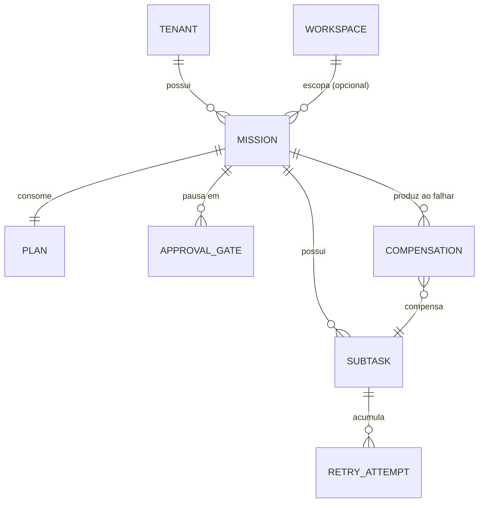

# Mission Model

Modelo de domínio do Mission Engine — a entidade que responde "o que deve acontecer, quem executa, quando, em qual ordem, com quais permissões" (ver [MISSION_MANIFESTO.md](MISSION_MANIFESTO.md)). Escrito antes de qualquer código da Release 5, mesmo princípio já seguido por [IDENTITY_MODEL.md](IDENTITY_MODEL.md) e [MEMORY_MODEL.md](MEMORY_MODEL.md): nenhuma linha de código do Mission Engine é escrita antes deste modelo estar aprovado.

[DOMAIN.md](DOMAIN.md), [ARCHITECTURE.md §5-6](docs/architecture/ARCHITECTURE.md), [SIGMA_PROTOCOL.md](SIGMA_PROTOCOL.md) e três ADRs ([0003](docs/adr/0003-mission-como-entidade-central.md), [0028](docs/adr/0028-intencao-nao-comando.md), [0031](docs/adr/0031-ordem-runtime-vs-desenvolvimento.md)) já definem Mission em prosa — este documento é onde ela ganha modelagem completa: entidades, identificadores, relações, e a mecânica que os documentos anteriores deixaram deliberadamente em aberto (aprovação, retries, compensações — ver [MISSION_MANIFESTO.md](MISSION_MANIFESTO.md#o-que-este-manifesto-acrescenta--a-parte-nova-pedida-explicitamente)).

## Onde o domínio de Mission começa — e onde não começa

**Decisão central deste modelo, resolvendo uma tensão real entre `ARCHITECTURE.md §6` e o resto do sistema** (ver [ADR-0089](docs/adr/0089-mission-nasce-do-plan-nao-da-intent.md)): o esboço de ciclo de vida em `ARCHITECTURE.md §6` mistura dois momentos distintos — "Recebida → Interpretando → Planejando" (decisões do Intent Engine e do Planner Engine, **antes** de qualquer `Mission` existir) e "SubtarefasCriadas → EmExecucao → ... → Concluida" (o que de fato é responsabilidade do Mission Engine). Este modelo formaliza a fronteira: **uma `Mission`, como Aggregate Root, só passa a existir quando um `Plan` já está pronto** — a interpretação de uma Intent e o planejamento que a decompõe em Missions candidatas acontecem antes, são responsabilidade de Intent/Planner Engine (Releases 7/6), nunca do Mission Engine. `IntentDetected`/`IntentRejected`/`MissionPlanned` continuam existindo como eventos Technical (ver [EVENT_MODEL.md](EVENT_MODEL.md)), mas nenhum deles é produzido pelo Mission Engine nem representa um estado de uma `Mission` — são o que acontece **antes** dela nascer.

## As entidades

### Mission (Aggregate Root)

A unidade de trabalho do SIGMA. Carrega:

- `id` (`MissionId`).
- `tenantId`: sempre presente ([ADR-0021](docs/adr/0021-multitenancy-desde-o-schema.md)).
- `workspaceId`: **opcional** — decisão nova, ver [ADR-0093](docs/adr/0093-mission-workspace-opcional.md). A maioria das Missions nasce dentro de um Workspace (`WORKSPACES.md` já dizia "tipicamente"), mas uma Mission de manutenção/sistema (ex: reindexar Knowledge, rodar uma verificação interna) não tem, nem precisa ter, um cliente/contexto de negócio associado.
- `correlationId`: sempre presente — o identificador estável que atravessa toda a cadeia Intent→Missions relacionadas ([SIGMA_PROTOCOL.md §1](SIGMA_PROTOCOL.md#1-o-envelope)). Na Release 5, sem Intent Engine real, é fornecido por quem cria a Mission (um teste, ou futuramente o Planner) — nunca gerado a partir de uma Intent que ainda não existe.
- `intentId`: opcional — a Intent de origem, quando existir de fato (Release 7+). `null` é um valor válido e esperado durante toda a Release 5/6, não um estado de erro.
- `objective`: a frase-objetivo herdada da Intent de origem (ver `DOMAIN.md#intent`, [ADR-0036](docs/adr/0036-objetivo-e-campo-da-intent.md)) — mesmo sem uma Intent real ainda, toda Mission carrega sua própria frase-objetivo, curta e declarativa.
- `plan`: o `Plan` recebido como entrada (ver abaixo) — nunca modificado depois da criação da Mission; é o "contrato" que a Mission está executando.
- `subtasks`: lista de `Subtask` "em execução" — ver `ARCHITECTURE.md §5`, que já distingue a Subtask candidata do Planner da Subtask em execução da Mission. Nascem uma a uma a partir das Subtasks candidatas do `Plan`, no momento em que o Mission Engine as aceita.
- `status`: `MissionStatus` — ver "Como o ciclo de vida funciona" abaixo.
- `autonomyCeiling`: o nível de Autonomia Progressiva (0-3) resolvido para esta Mission no momento da criação, a partir do User/Role que a originou (mesmo mecanismo de [SIGMA_PROTOCOL.md §5](SIGMA_PROTOCOL.md#5-autonomia-progressiva)) — o teto que nenhuma Subtask desta Mission pode ultrapassar, mesmo que a Capability específica permitisse mais.
- `actor`: quem originou a Mission — `{ type: "user" | "system" | "agent", id }`, mesmo formato do campo `actor` do Envelope ([SIGMA_PROTOCOL.md §1](SIGMA_PROTOCOL.md#1-o-envelope)).
- `history`: lista append-only de transições de estado já ocorridas — nunca editada, só acrescida (mesmo princípio de "eventos não são reescritos", [EVENT_MODEL.md](EVENT_MODEL.md#regras)).
- `createdAt`, `startedAt` (nullable), `finishedAt` (nullable).

### Subtask

Uma unidade de trabalho dentro de uma Mission, "em execução" (distinta da Subtask candidata dentro de um `Plan`, ver abaixo). Carrega:

- `id` (`SubtaskId`).
- `description`: o que precisa ser feito, herdado da Subtask candidata correspondente no `Plan`.
- `candidateAgent`/`candidateCapability`: sugestões herdadas do `Plan` — o Agent Engine (Release 9) decide de fato quem executa; o Mission Engine nunca resolve isso sozinho.
- `status`: `SubtaskStatus` — `Pending` \| `Assigned` \| `Executing` \| `Validated` \| `Failed` \| `Compensated` \| `Skipped`.
- `retryAttempts`: lista de `RetryAttempt` — histórico de tentativas, nunca um contador solto (ver "Retry é histórico de Subtask" abaixo).
- `result`: o resultado de negócio, quando concluída (o equivalente ao campo `data` do Envelope que a execução desta Subtask produziu).

### Plan

O plano recebido como entrada — nunca produzido pelo Mission Engine, sempre consumido. Carrega:

- `subtaskCandidates`: lista de especificações de Subtask (descrição, Agent/Capability sugeridos, ordem) — a forma "candidata", antes de a Mission aceitá-las como `Subtask` em execução.
- `source`: `Planner` \| `Manual` — **decisão da Release 5** ([ADR-0092](docs/adr/0092-plan-e-conceito-proprio-do-mission-engine.md)): como o Planner Engine (Release 6) ainda não existe, todo `Plan` consumido nesta Release é `Manual` (fornecido por um teste ou por quem chama a Application diretamente) — o Mission Engine nunca importa nem depende de `packages/planner-engine`, só entende a forma de dado `Plan`, que é conceito do próprio Mission Engine (ver "Fronteira com o Planner Engine" abaixo).

`Plan` não é um Aggregate próprio — é um Value Object de entrada, imutável, sem identidade própria além da Mission que o consome.

### ApprovalGate

Um pedido de decisão humana pendente — o que bloqueia uma Mission em `PendingApproval` (ver [ADR-0090](docs/adr/0090-aprovacao-como-estado-de-primeira-classe.md)). Carrega:

- `id` (`ApprovalGateId`).
- `reason`: por que a aprovação é necessária (`autonomyCeiling` insuficiente para a próxima Subtask; ou um gate explícito do Plan, ver `playbooks/template.md`).
- `requestedAt`.
- `decision`: `Pending` \| `Approved` \| `Rejected`.
- `decidedAt`/`decidedBy` (nullable até haver decisão).

### RetryAttempt

Um registro de tentativa — nunca um contador solto, para preservar o histórico completo de por que uma Subtask precisou repetir. Carrega `attemptNumber`, `reason`, `at`.

### Compensation

O registro de uma ação de compensação — o que a Mission faz para desfazer ou sinalizar o efeito de uma Subtask que falhou definitivamente depois de já ter produzido efeito real (ver [ADR-0091](docs/adr/0091-retry-subtask-compensacao-mission.md)). Carrega `subtaskId` (a Subtask que falhou), `action` (descrição do que foi feito para compensar — texto livre nesta Release, nenhuma taxonomia fechada ainda), `at`, `result` (`Compensated` \| `CompensationFailed`).

## Como o ciclo de vida funciona (visão de entidades — o fluxo completo está em MISSION_LIFECYCLE.md)

`MissionStatus`: `Created` → `PendingApproval` (condicional) → `InProgress` → `Compensating` (condicional) → `Validating` → `Completed` \| `Failed` \| `Cancelled` (de qualquer estado ativo).

- **Retry é histórico de Subtask, nunca um `MissionStatus` próprio** — uma Mission com uma Subtask tentando de novo continua `InProgress`. Só quando as tentativas se esgotam (política de retry, número exato decidido em Implementation) a Mission muda de fato de estado.
- **Compensação é estado da Mission, não só da Subtask** — quando uma Subtask falha definitivamente com efeito colateral já produzido, a Mission inteira entra em `Compensating`, porque o que precisa ser resolvido não é mais "esta Subtask", é "o que a Mission já fez até aqui".
- **Aprovação bloqueia a Mission inteira, não só uma chamada** — distinto do gate por Capability já existente em [SIGMA_PROTOCOL.md §5](SIGMA_PROTOCOL.md#5-autonomia-progressiva) (que segue existindo, por chamada). Um `ApprovalGate` pendente impede qualquer nova Subtask de começar, mesmo que outras Subtasks da mesma Mission pudessem prosseguir sem gate — decisão deliberada de simplicidade: uma Mission pendente de aprovação pausa por inteiro, não em partes.

## Fronteira com o Planner Engine (Release 6, ainda não existe)

Mission Engine (Release 5) é construído e testado contra um `Plan` fornecido manualmente — nunca importa `packages/planner-engine` como dependência de código ([ADR-0031](docs/adr/0031-ordem-runtime-vs-desenvolvimento.md), [ADR-0092](docs/adr/0092-plan-e-conceito-proprio-do-mission-engine.md)). Quando o Planner Engine existir, ele publicará `Plan`s reais na mesma forma de dado já modelada aqui — o Mission Engine não muda, só passa a receber `Plan.source: Planner` em vez de `Manual`. `packages/README.md`/`packages/mission-engine/README.md` corrigidos nesta rodada — ambos citavam incorretamente uma dependência Composer de `planner-engine` que contradizia a Ordem de Desenvolvimento já decidida.

## Fronteira com o Skill/Agent/Execution Engine (Releases 8-10, ainda não existem)

Mission Engine nunca invoca uma Capability diretamente, nunca resolve qual Agent executa uma Subtask — isso é responsabilidade do Agent Engine (Release 9)/Execution Engine (Release 10). Nesta Release, a transição `Subtask.status: Assigned → Executing → Validated/Failed` é acionada por quem chama a Application do Mission Engine (um teste, ou futuramente o Agent/Execution Engine via evento) — o próprio domínio só valida que a transição é permitida, nunca executa nada por conta própria.

## Relações

| Relação | Cardinalidade | Observação |
|---|---|---|
| Tenant → Mission | 1 para N | `tenant_id` obrigatório, sem exceção (ADR-0021) |
| Workspace → Mission | 1 para N, opcional | Mission de sistema/manutenção pode não ter Workspace (ADR-0093) |
| Mission → Plan | 1 para 1 | Consumido na criação, nunca modificado depois |
| Mission → Subtask | 1 para N | Nascem do `Plan.subtaskCandidates`, uma a uma |
| Subtask → RetryAttempt | 1 para N | Histórico completo, nunca um contador solto |
| Mission → ApprovalGate | 1 para N | Normalmente 0 ou 1 pendente por vez; histórico completo preservado |
| Mission → Compensation | 1 para N | Uma por Subtask que falhou definitivamente com efeito já produzido |

## O que este modelo não decide

- Schema físico de tabelas — Implementation da Release 5A/5B, não deste modelo.
- Número exato de tentativas de retry, política de backoff — decisão de Implementation/configuração, não deste modelo (mesmo padrão de `MEMORY_PROMOTION_RULES.md` deixar pisos de `confidence` como parâmetro configurável).
- Taxonomia fechada de tipos de `Compensation.action` — texto livre nesta Release; uma taxonomia (ex: por tipo de Capability) é decisão futura, quando houver Capabilities reais o suficiente para generalizar um padrão.
- Timeout de um `ApprovalGate` pendente (expira sozinho? fica pendente indefinidamente?) — decisão de Implementation.
- Como o Agent Engine/Execution Engine (Releases 9/10) de fato disparam as transições de `Subtask` — Mission Engine só define que a transição é válida, não quem a aciona de verdade.
- Unificação de autonomia/aprovação num Policy Engine central — sinalizado, sem Release própria (ver [MISSION_MANIFESTO.md](MISSION_MANIFESTO.md#o-que-este-manifesto-não-decide)).

## Onde vive

Fundação em `packages/mission-engine` — Release 5 do [ROADMAP.md](ROADMAP.md). Depende só de `core`/`kernel` (nunca de `planner-engine`, `agent-engine`, `skill-engine` ou `execution-engine` como dependência de código) — consome identidade/contexto já resolvido pelo Identity Engine através do Kernel, nunca resolve Tenant/Workspace por conta própria.
