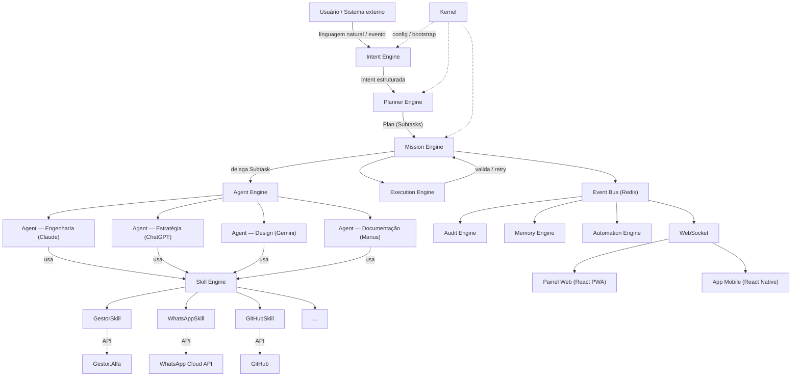
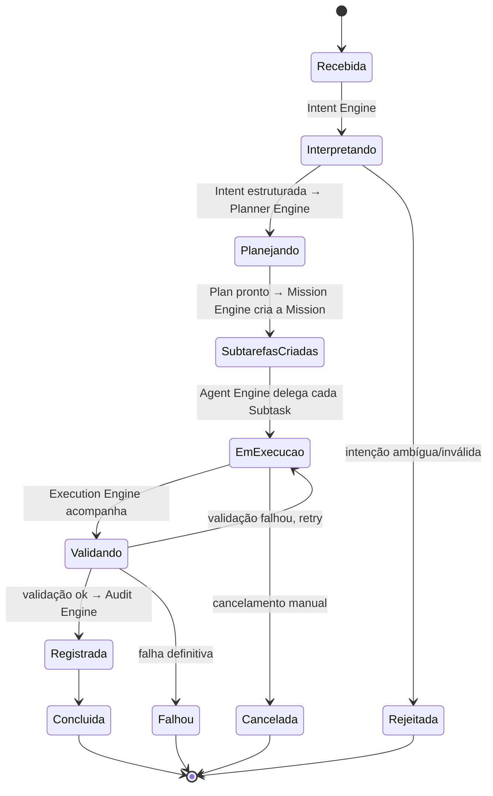

# Arquitetura de Alto Nível — SIGMA

Este documento descreve como o SIGMA é estruturado: os Engines que compõem seu núcleo, o modelo de domínio, o ciclo de vida da Mission, o contrato de Skill, o modelo de Agentes, e a stack de referência. É o documento a se manter atualizado conforme decisões evoluem; decisões pontuais e seu porquê ficam registradas em [docs/adr/](../adr/).

## 0. SIGMA é um Sistema Operacional, não uma IA

Antes de qualquer diagrama: o SIGMA não é um chat inteligente com plugins. É uma plataforma operacional corporativa, com um Kernel e Engines de responsabilidade única — cada um resolvendo um problema específico do ciclo de vida de uma Mission. IA é uma capacidade que alguns desses Engines usam (Agent Engine, ao delegar uma Subtask), não a identidade do sistema como um todo. Ver [MANIFESTO.md](../../MANIFESTO.md), [KERNEL.md](../../KERNEL.md) e [ADR-0014](../adr/0014-sigma-e-um-sistema-operacional-nao-uma-ia.md).

## 1. Princípios

- **DDD** — o domínio (Mission, Skill, Agent, Knowledge, Memory...) é modelado primeiro, isolado de framework e infraestrutura.
- **Clean Architecture** — dependências apontam para dentro: domínio não conhece infraestrutura; infraestrutura implementa contratos do domínio.
- **Event-Driven** — Engines não se chamam diretamente; comunicam-se por eventos de domínio.
- **SOLID**, alta coesão, baixo acoplamento — em cada módulo e entre módulos.
- **Desacoplamento físico** — SIGMA nunca acessa o banco de dados de outro sistema (Gestor.Alfa, AlfaControl, AlfaGym, AlfaJornada, AlfaCam...). Toda comunicação com sistemas externos é via API. Ver [ADR-0007](../adr/0007-comunicacao-somente-via-api.md).
- **O Planner decide, a IA executa** — nenhum Agent decide o que uma Mission deve fazer; ele executa a Subtask que o Planner Engine já definiu. Ver [ADR-0012](../adr/0012-planner-decide-nunca-a-ia.md).

## 2. Os nove Engines

O núcleo do SIGMA é composto por nove Engines, cada um com responsabilidade única. Ver [ADR-0011](../adr/0011-arquitetura-em-camadas-de-engines.md).

| # | Engine | Responsabilidade |
|---|---|---|
| 0 | **Kernel** | Ciclo de vida da plataforma: bootstrap, configuração, contexto de execução, health |
| 1 | **Intent Engine** | Interpreta linguagem natural/eventos em uma `Intent` estruturada |
| 2 | **Planner Engine** | Monta o `Plan` de execução a partir de uma Intent — decide, nunca a IA |
| 3 | **Mission Engine** | Gerencia a `Mission` e seu progresso a partir de um Plan |
| 4 | **Memory Engine** | Organiza `Knowledge` (o que se sabe) e `Memory` (o que se aprendeu) |
| 5 | **Agent Engine** | Decide qual `Agent` executa cada `Subtask` |
| 6 | **Skill Engine** | Conversa com sistemas externos através de `Skills` |
| 7 | **Execution Engine** | Acompanha e valida a execução de cada Subtask em andamento |
| 8 | **Audit Engine** | Registra `Events` e `Logs` — rastreabilidade de tudo que acontece |

Interfaces (painel Web, App Mobile), **Automation Engine** e **Analytics** consomem estes nove Engines através de eventos e API — não fazem parte do núcleo de orquestração.

## 3. Visão geral do sistema



SIGMA nunca fala diretamente com um sistema externo, e nenhum Engine decide fora do seu papel: **Intent Engine interpreta → Planner Engine decide → Mission Engine acompanha → Agent Engine delega → Skill Engine age → Execution Engine valida → Audit Engine registra.** Essa cadeia é o que permite trocar um provedor de IA ou uma integração sem tocar no núcleo, e auditar exatamente onde uma Mission está a qualquer momento.

## 4. As três camadas de execução (dentro do Agent Engine)

Um erro comum em sistemas de orquestração de IA é misturar "o modelo" com "quem o usa" e com "o que ele pode fazer". SIGMA separa isso em três conceitos distintos, geridos pelo Agent Engine e pelo Skill Engine:

| Camada | Entidade | Responsabilidade | Exemplo |
|---|---|---|---|
| Provedor | **IA** | Credenciais, limites, custo, capacidades técnicas de um modelo | Claude API, OpenAI API, Gemini API, Manus |
| Persona operacional | **Agent** | Uma especialidade que usa uma IA para um tipo de trabalho | Agent de Engenharia (usa Claude), Agent de Estratégia (usa ChatGPT) |
| Capacidade de ação | **Skill** | Uma integração concreta que um Agent invoca para agir no mundo | GitHubSkill, WhatsAppSkill, GestorSkill |

Um Agent nunca acessa uma API externa diretamente — ele solicita ao Skill Engine. Ver [ADR-0004](../adr/0004-tres-camadas-ia-agente-skill.md) e a documentação de cada Agent em [/agents](../../agents/).

### Especialidades de Agent (conjunto inicial)

| Agent | IA | Especialidade | Documentação |
|---|---|---|---|
| Agent de Engenharia | Claude | Engenharia de Software | [agents/claude.md](../../agents/claude.md) |
| Agent de Estratégia | ChatGPT | Estratégia | [agents/chatgpt.md](../../agents/chatgpt.md) |
| Agent de Design | Gemini | Design | [agents/gemini.md](../../agents/gemini.md) |
| Agent de Documentação | Manus | Documentação | [agents/manus.md](../../agents/manus.md) |

Novas IAs e Agents serão adicionados por configuração, não por alteração de domínio.

## 5. Modelo de domínio

Ver o glossário completo em [DOMAIN.md](../../DOMAIN.md). Os domínios se agrupam em contextos delimitados (bounded contexts), cada um primariamente servido por um ou mais Engines:

| Contexto | Entidades | Engine principal |
|---|---|---|
| **Interpretação** | Intent | Intent Engine |
| **Planejamento** | Plan, Subtask (candidatos) | Planner Engine |
| **Missão** (núcleo) | Mission, Subtask (em execução) | Mission Engine |
| **Conhecimento** | Knowledge, Memory | Memory Engine |
| **Capacidade** | Agent, IA | Agent Engine |
| **Integração** | Skill, Integration | Skill Engine |
| **Rastreabilidade** | Event, Log | Audit Engine |
| **Identidade & Organização** | User, Team, Company | (contexto de apoio, sem Engine dedicado) |
| **Negócio** | Client, Contact, Project, Product, Budget, Document, Meeting | (referenciado via Skill, fonte da verdade externa) |
| **Processo** | Process, Automation | Automation Engine |

Contextos se comunicam exclusivamente por eventos de domínio publicados no Event Bus — nunca por chamada direta entre módulos. O detalhamento de cada entidade (atributos, invariantes, relacionamentos) é expandido épico a épico conforme cada Engine é implementado — modelar em detalhe antes do épico correspondente ser aprovado gera documentação que se torna fictícia.

## 6. Mission — ciclo de vida através dos Engines

Uma Mission nasce de uma Intent já planejada e é gerenciada pelo Mission Engine até sua conclusão.



Cada transição de estado publica um evento de domínio, consumido pelo Audit Engine (rastreabilidade), Memory Engine (aprendizado) e WebSocket (tempo real no painel). O catálogo canônico e nomeado desses eventos — `MissionRequested`, `IntentDetected`, `MissionPlanned`, `SubtaskAssigned`, `SkillRequested`, `ExecutionStarted`, `ExecutionValidated`/`ExecutionFailed`, `MissionFinished` — é mantido como fonte única da verdade em [EVENT_MODEL.md](../../EVENT_MODEL.md), não duplicado aqui. Ver também [ADR-0018](../adr/0018-tudo-e-evento.md).

## 7. Skill — contrato

Toda integração externa é modelada como Skill, operada pelo Skill Engine. Uma Skill é desacoplada e possui, obrigatoriamente:

- **Configuração** — como a Skill é ativada e parametrizada por empresa/ambiente.
- **Permissões** — quem (qual Agent, qual Mission) pode invocá-la e para quê.
- **Entrada** — contrato de dados que a Skill aceita.
- **Saída** — contrato de dados que a Skill devolve.
- **Eventos** — o que a Skill publica no Event Bus ao ser executada (sucesso, falha, progresso).
- **Logs** — toda invocação é registrada, correlacionada à Mission que a originou.
- **Testes** — contrato coberto por testes automatizados antes de ir ao ar.
- **Documentação** — o que a Skill faz, como configurá-la, exemplos de uso.

Contrato de referência (assinatura, não implementação — a implementação nasce com o épico que entrega a primeira Skill real):

```php
interface Skill
{
    public function name(): string;
    public function configure(SkillConfig $config): void;
    public function authorize(Agent $agent, Mission $mission): bool;
    public function execute(SkillInput $input): SkillOutput;
}
```

Skills previstas, documentadas em [/skills](../../skills/): `GestorSkill`, `GitHubSkill`, `TelegramSkill`, `GoogleCalendarSkill`, `EmailSkill`, `WhatsAppSkill` — e futuramente `DockerSkill`, entre outras. A partir da Sprint 0.2, toda Skill é implementada tecnicamente como um **Plugin** carregado dinamicamente pelo Skill Engine, nunca uma classe compilada no núcleo — ver [PLUGIN_SYSTEM.md](../../PLUGIN_SYSTEM.md) e [ADR-0017](../adr/0017-plugin-system.md).

## 8. Estrutura do monorepo

O SIGMA é organizado em `apps/`, `packages/`, `services/`, `plugins/`, `docs/`, `tools/` e `docker/` — ver [ADR-0016](../adr/0016-monorepo-apps-packages-services.md) e o índice de cada pasta ([apps/](../../apps/), [packages/](../../packages/), [services/](../../services/), [plugins/](../../plugins/)). Cada Engine descrito na seção 2 vive como um pacote em `packages/`; `services/gateway` é a aplicação Laravel que os monta e expõe via HTTP/WebSocket.

Dentro de cada pacote de Engine, a mesma estrutura interna isola domínio de infraestrutura:

```
packages/<engine>/
├── Domain/
│   ├── Entities/
│   ├── ValueObjects/
│   ├── Events/
│   └── Repositories/          # contratos (interfaces)
├── Application/
│   ├── Actions/
│   ├── Services/
│   └── DTOs/
├── Infrastructure/
│   ├── Repositories/           # implementações (Eloquent)
│   ├── Listeners/
│   └── Observers/
└── Presentation/
    ├── Controllers/
    ├── Policies/
    └── Resources/
```

Ex.: `packages/mission-engine/`, `packages/planner-engine/`, `packages/skill-engine/`. Esta estrutura é o padrão a ser usado a partir do primeiro épico de implementação; nenhum código é criado na Fase Foundation.

## 9. Stack de referência

| Camada | Tecnologia |
|---|---|
| Backend | Laravel 12, PHP 8.4, DDD, Event-Driven, Redis, MariaDB, API REST, WebSocket, Queues, Scheduler |
| Frontend Web | React, TypeScript, Vite, PWA, Design System próprio, Dark Mode, Offline, Responsivo |
| Mobile | React Native, Expo — mesmo Design System, mesmo Backend |
| Infraestrutura de eventos | Redis (filas, pub/sub, broadcasting) |

Justificativa e alternativas consideradas em [ADR-0009](../adr/0009-stack-tecnologica-de-referencia.md).

## 10. Regras de desacoplamento

1. SIGMA nunca acessa diretamente o banco de dados de outro sistema Alfa. Toda leitura e escrita em Gestor.Alfa, AlfaControl, AlfaGym, AlfaJornada, AlfaCam etc. acontece através da API pública desses sistemas, encapsulada numa Skill operada pelo Skill Engine.
2. Um Engine nunca chama outro Engine diretamente — apenas via eventos publicados no Event Bus, exceto a cadeia síncrona explícita Intent → Planner → Mission → Agent (delegação de Subtask), que é o próprio fluxo de orquestração.
3. Um Agent nunca invoca uma API externa diretamente — sempre através do Skill Engine.
4. Nenhuma Skill mantém estado de negócio próprio além do necessário para operar (idempotência, retry) — a fonte da verdade de cada domínio de negócio permanece no sistema dono desse domínio.
5. O Planner Engine decide o Plan; nenhum Agent decide, por conta própria, o que uma Mission deve fazer. Ver [ADR-0012](../adr/0012-planner-decide-nunca-a-ia.md).

Ver também [ADR-0007](../adr/0007-comunicacao-somente-via-api.md).

## 11. Documentos relacionados

Este documento cobre a arquitetura de alto nível; os seguintes aprofundam decisões específicas sem duplicar conteúdo:

| Documento | Cobre |
|---|---|
| [KERNEL.md](../../KERNEL.md) | O que pertence e o que nunca pertence ao Kernel |
| [PLUGIN_SYSTEM.md](../../PLUGIN_SYSTEM.md) | Como uma Skill é empacotada e carregada como Plugin |
| [EVENT_MODEL.md](../../EVENT_MODEL.md) | Catálogo canônico de eventos e a filosofia "tudo é evento" |
| [TELEMETRY.md](../../TELEMETRY.md) | Logs, Metrics, Tracing, Audit — observabilidade desde o dia zero |
| [WORKSPACES.md](../../WORKSPACES.md) | A unidade de contexto operacional (Workspace) |
| [MULTITENANCY.md](../../MULTITENANCY.md) | A hierarquia Tenant → Company → Workspace → User → Role |
| [MEMORY_ARCHITECTURE.md](../../MEMORY_ARCHITECTURE.md) | Os três níveis de Memory |
