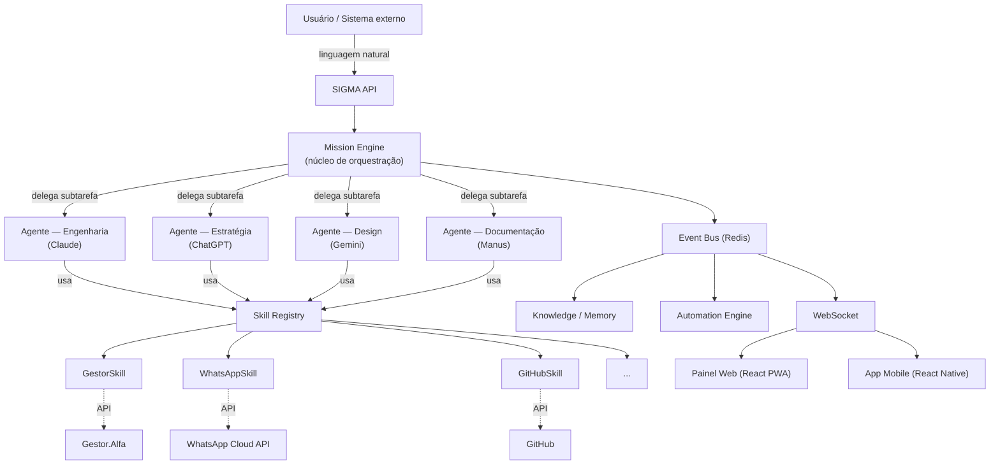
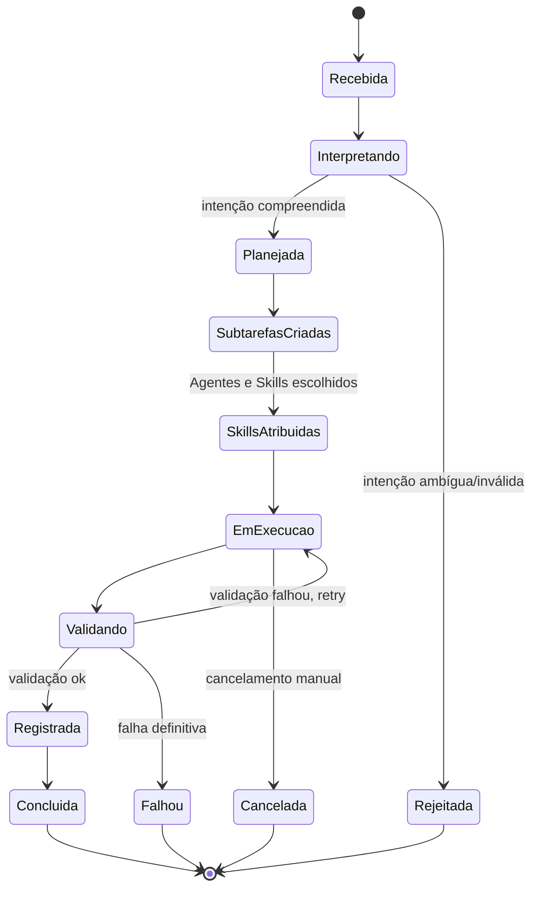

# Arquitetura de Alto Nível — SIGMA

Este documento descreve como o SIGMA é estruturado: modelo de domínio, contextos delimitados, ciclo de vida da Missão, o contrato de Skill, o modelo de orquestração de Agentes, e a stack de referência. É o documento a se manter atualizado conforme decisões evoluem; decisões pontuais e seu porquê ficam registradas em [docs/adr/](../adr/).

## 1. Princípios

- **DDD** — o domínio (Mission, Skill, Agent, Knowledge, Memory...) é modelado primeiro, isolado de framework e infraestrutura.
- **Clean Architecture** — dependências apontam para dentro: domínio não conhece infraestrutura; infraestrutura implementa contratos do domínio.
- **Event-Driven** — contextos delimitados não se chamam diretamente; comunicam-se por eventos de domínio.
- **SOLID**, alta coesão, baixo acoplamento — em cada módulo e entre módulos.
- **Desacoplamento físico** — SIGMA nunca acessa o banco de dados de outro sistema (Gestor.Alfa, AlfaControl, AlfaGym, AlfaJornada, AlfaCam...). Toda comunicação com sistemas externos é via API. Ver [ADR-0007](../adr/0007-comunicacao-somente-via-api.md).

## 2. Visão geral do sistema



SIGMA nunca fala diretamente com um sistema externo. A cadeia é sempre **Missão → Agente → Skill → API externa**. Essa indireção é o que permite trocar um provedor de IA ou uma integração sem tocar no domínio.

## 3. As três camadas de execução

Um erro comum em sistemas de orquestração de IA é misturar "o modelo" com "quem o usa" e com "o que ele pode fazer". SIGMA separa isso em três conceitos distintos:

| Camada | Entidade | Responsabilidade | Exemplo |
|---|---|---|---|
| Provedor | **IA** | Credenciais, limites, custo, capacidades técnicas de um modelo | Claude API, OpenAI API, Gemini API, Manus |
| Persona operacional | **Agente** | Uma especialidade que usa uma IA para um tipo de trabalho | Agente de Engenharia (usa Claude), Agente de Estratégia (usa ChatGPT) |
| Capacidade de ação | **Skill** | Uma integração concreta que um Agente invoca para agir no mundo | GitHubSkill, WhatsAppSkill, GestorSkill |

Um Agente nunca acessa uma API externa diretamente — ele solicita a uma Skill. Isso mantém a permissão, o log e o contrato de entrada/saída centralizados na Skill, não espalhados em cada Agente. Ver [ADR-0004](../adr/0004-tres-camadas-ia-agente-skill.md).

### Especialidades de Agente (conjunto inicial)

| Agente | IA | Especialidade |
|---|---|---|
| Agente de Engenharia | Claude | Engenharia de Software |
| Agente de Estratégia | ChatGPT | Estratégia |
| Agente de Design | Gemini | Design |
| Agente de Documentação | Manus | Documentação |

Novas IAs e Agentes serão adicionados por configuração, não por alteração de domínio.

## 4. Modelo de domínio

Os 16 domínios de gestão identificados na concepção do SIGMA se agrupam em contextos delimitados (bounded contexts):

| Contexto | Entidades | Responsabilidade |
|---|---|---|
| **Mission** (núcleo) | Mission, Plan, Subtask | O ciclo de vida de toda ação do sistema |
| **Capability** | Agent, IA, Skill | Quem executa e com o que |
| **Knowledge** | Knowledge, Memory | O que o sistema sabe e aprendeu |
| **Identity & Organization** | User, Team, Company | Quem opera o sistema e por qual empresa |
| **Business** | Client, Project | O que está sendo orquestrado, para quem |
| **Process** | Process | Fluxos e procedimentos reutilizáveis (SOPs) que uma Missão pode seguir |
| **Operations** | Event, Log, Automation | Rastreabilidade e reação automática a eventos de domínio |
| **Integration** | Integration | Metadados e configuração das integrações concretas usadas pelas Skills |

Contextos se comunicam exclusivamente por eventos de domínio publicados no Event Bus — nunca por chamada direta entre módulos de domínio. O detalhamento de cada entidade (atributos, invariantes, relacionamentos) vive em `docs/architecture/domain-model.md`, a ser expandido épico a épico conforme cada contexto é implementado — modelar em detalhe uma entidade antes de o épico que a implementa ser aprovado gera documentação que se torna fictícia.

## 5. Mission — entidade central

Uma Missão é uma solicitação — de um usuário ou de outro sistema — que o SIGMA interpreta, planeja e executa através de Agentes e Skills.



Cada transição de estado publica um evento de domínio (`MissionInterpreted`, `MissionPlanned`, `SubtasksCreated`, `MissionExecuting`, `MissionValidated`, `MissionCompleted`, `MissionFailed`...) consumido por Knowledge/Memory (aprendizado), Automation (reação) e WebSocket (tempo real no painel).

## 6. Skill — contrato

Toda integração externa é modelada como Skill. Uma Skill é desacoplada e possui, obrigatoriamente:

- **Configuração** — como a Skill é ativada e parametrizada por empresa/ambiente.
- **Permissões** — quem (qual Agente, qual Missão) pode invocá-la e para quê.
- **Entrada** — contrato de dados que a Skill aceita.
- **Saída** — contrato de dados que a Skill devolve.
- **Eventos** — o que a Skill publica no Event Bus ao ser executada (sucesso, falha, progresso).
- **Logs** — toda invocação é registrada, correlacionada à Missão que a originou.
- **Testes** — contrato coberto por testes automatizados antes de ir ao ar.
- **Documentação** — o que a Skill faz, como configurá-la, exemplos de uso.

Contrato de referência (assinatura, não implementação — a implementação nasce com o épico que entrega a primeira Skill real):

```php
interface Skill
{
    public function name(): string;
    public function configure(SkillConfig $config): void;
    public function authorize(Agent $agent, Mission $mission): bool;
    public function execute(SkillInput $input): SkillOutput;
}
```

Exemplos de Skills previstas: `GestorSkill`, `GitHubSkill`, `TelegramSkill`, `EmailSkill`, `GoogleCalendarSkill`, `DockerSkill`, `WhatsAppSkill`.

## 7. Estrutura de módulo (backend)

Cada contexto delimitado do backend Laravel segue a mesma estrutura interna, isolando domínio de infraestrutura:

```
backend/app/Modules/<Contexto>/
├── Domain/
│   ├── Entities/
│   ├── ValueObjects/
│   ├── Events/
│   └── Repositories/          # contratos (interfaces)
├── Application/
│   ├── Actions/
│   ├── Services/
│   └── DTOs/
├── Infrastructure/
│   ├── Repositories/           # implementações (Eloquent)
│   ├── Listeners/
│   └── Observers/
└── Presentation/
    ├── Controllers/
    ├── Policies/
    └── Resources/
```

Esta estrutura é o padrão a ser usado a partir do primeiro épico de implementação; nenhum código é criado na Fase Foundation.

## 8. Stack de referência

| Camada | Tecnologia |
|---|---|
| Backend | Laravel 12, PHP 8.4, DDD, Event-Driven, Redis, MariaDB, API REST, WebSocket, Queues, Scheduler |
| Frontend Web | React, TypeScript, Vite, PWA, Design System próprio, Dark Mode, Offline, Responsivo |
| Mobile | React Native, Expo — mesmo Design System, mesmo Backend |
| Infraestrutura de eventos | Redis (filas, pub/sub, broadcasting) |

Justificativa e alternativas consideradas em [ADR-0009](../adr/0009-stack-tecnologica-de-referencia.md).

## 9. Regras de desacoplamento

1. SIGMA nunca acessa diretamente o banco de dados de outro sistema Alfa. Toda leitura e escrita em Gestor.Alfa, AlfaControl, AlfaGym, AlfaJornada, AlfaCam etc. acontece através da API pública desses sistemas, encapsulada numa Skill.
2. Um contexto de domínio do SIGMA nunca chama outro contexto diretamente — apenas via eventos publicados no Event Bus.
3. Um Agente nunca invoca uma API externa diretamente — sempre através de uma Skill autorizada.
4. Nenhuma Skill mantém estado de negócio próprio além do necessário para operar (idempotência, retry) — a fonte da verdade de cada domínio de negócio permanece no sistema dono desse domínio.

Ver [ADR-0007](../adr/0007-comunicacao-somente-via-api.md).
